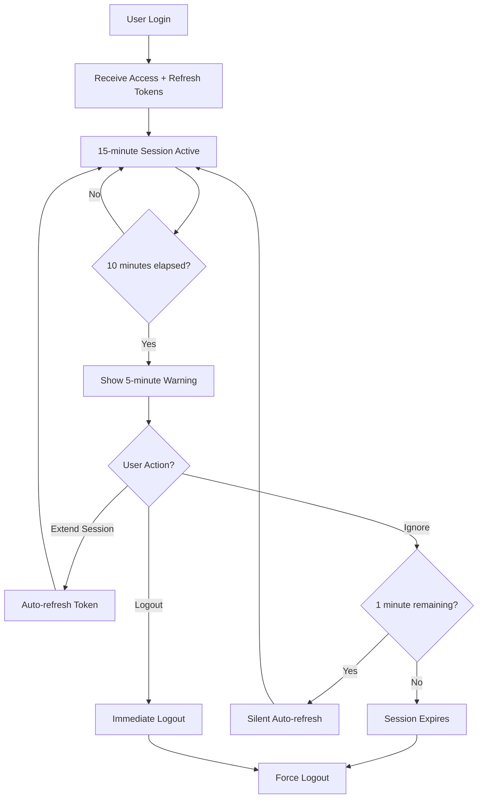

# 🔄 JWT Refresh Token Implementation

## Overview

This document describes the implementation of **Issue #4: Short JWT Token Expiry** with a comprehensive refresh token mechanism that reduces session vulnerability while maintaining user experience through intelligent session extension.

## 🚨 Security Issue Resolved

### Before (Vulnerable)
```javascript
// 30-minute sessions with no refresh mechanism
const SESSION_TIMEOUT_MINUTES = 30;
// Single access token only
authToken = data.access_token;
```

### After (Secure)
```javascript
// 15-minute access tokens with 7-day refresh tokens
const SESSION_TIMEOUT_MINUTES = 15;
const WARNING_THRESHOLD_MS = 5 * 60 * 1000; // 5 minutes warning
const CRITICAL_THRESHOLD_MS = 2 * 60 * 1000; // 2 minutes critical warning

// Dual token system
authToken = data.access_token;
refreshToken = data.refresh_token;
```

## 🔧 Technical Implementation

### 1. Backend Token System

**Enhanced Security Module** (`web_app/app/core/security.py`):

```python
def create_access_token(data: dict, expires_delta: Optional[timedelta] = None) -> str:
    """Create JWT access token with 15-minute expiry"""
    to_encode = data.copy()
    expire = datetime.utcnow() + timedelta(minutes=settings.ACCESS_TOKEN_EXPIRE_MINUTES)
    
    to_encode.update({
        "exp": expire,
        "iat": datetime.utcnow(),
        "type": "access"  # Token type identification
    })
    return jwt.encode(to_encode, settings.JWT_SECRET_KEY, algorithm="HS256")

def create_refresh_token(data: dict) -> str:
    """Create JWT refresh token with 7-day expiry"""
    to_encode = data.copy()
    expire = datetime.utcnow() + timedelta(days=7)
    
    to_encode.update({
        "exp": expire,
        "iat": datetime.utcnow(),
        "type": "refresh"  # Token type identification
    })
    return jwt.encode(to_encode, settings.JWT_SECRET_KEY, algorithm="HS256")

def get_token_expiry_info(token: str) -> Optional[dict]:
    """Get token expiry information for frontend"""
    payload = jwt.decode(token, options={"verify_signature": False})
    exp = payload.get("exp")
    
    if exp:
        exp_datetime = datetime.fromtimestamp(exp)
        time_remaining = exp_datetime - datetime.utcnow()
        
        return {
            "expires_at": exp_datetime,
            "time_remaining_seconds": max(0, int(time_remaining.total_seconds())),
            "is_expired": time_remaining.total_seconds() <= 0,
            "expires_soon": time_remaining.total_seconds() <= 300  # 5 minutes
        }
    return None
```

**Security Features**:
- ✅ **Token Type Validation**: Access and refresh tokens explicitly identified
- ✅ **Secure Expiry**: 15-minute access tokens reduce hijacking window
- ✅ **Long-term Refresh**: 7-day refresh tokens for seamless user experience
- ✅ **Expiry Intelligence**: Frontend gets precise expiry information

### 2. Enhanced Authentication Endpoints

**Updated Auth API** (`web_app/app/api/v1/endpoints/auth.py`):

```python
@router.post("/login", response_model=TokenResponse)
async def login(user_credentials: UserLogin, db: Session = Depends(get_db)):
    """Login with dual token response"""
    # ... authentication logic ...
    
    # Create both tokens
    access_token = create_access_token(data={"sub": user.username})
    refresh_token = create_refresh_token(data={"sub": user.username})
    
    return TokenResponse(
        access_token=access_token,
        refresh_token=refresh_token,
        token_type="bearer",
        expires_in=int(timedelta(minutes=15).total_seconds()),
        expires_at=expires_at.isoformat() + "Z"
    )

@router.post("/refresh", response_model=TokenResponse)
async def refresh_access_token(refresh_request: RefreshTokenRequest, db: Session = Depends(get_db)):
    """Refresh access token using refresh token"""
    # Verify refresh token
    payload = verify_token(refresh_request.refresh_token, token_type="refresh")
    
    if payload is None:
        raise HTTPException(status_code=401, detail="Invalid refresh token")
    
    # Create new access token
    access_token = create_access_token(data={"sub": payload.get("sub")})
    
    return TokenResponse(
        access_token=access_token,
        refresh_token=refresh_request.refresh_token,  # Same refresh token
        token_type="bearer",
        expires_in=900,  # 15 minutes
        expires_at=new_expires_at.isoformat() + "Z"
    )
```

**API Endpoints Added**:
- ✅ `POST /api/v1/auth/refresh` - Refresh access token
- ✅ `GET /api/v1/auth/token-status` - Get token status
- ✅ `POST /api/v1/auth/check-token-expiry` - Check expiry without auth

### 3. Enhanced Token Schemas

**Updated Response Models** (`web_app/app/schemas/auth.py`):

```python
class TokenResponse(BaseModel):
    access_token: str
    refresh_token: str
    token_type: str
    expires_in: int  # seconds until access token expires
    expires_at: str  # ISO timestamp of access token expiry

class RefreshTokenRequest(BaseModel):
    refresh_token: str

class TokenStatusResponse(BaseModel):
    valid: bool
    expires_at: Optional[str] = None
    expires_in: Optional[int] = None
    expires_soon: bool = False
    time_remaining_seconds: int = 0
```

## 🎨 Frontend User Experience

### 1. Intelligent Session Management

**Enhanced Session Timer** (`web_app/app/templates/index.html`):

```javascript
// Configuration
const SESSION_TIMEOUT_MINUTES = 15;
const WARNING_THRESHOLD_MS = 5 * 60 * 1000; // 5 minutes warning
const CRITICAL_THRESHOLD_MS = 2 * 60 * 1000; // 2 minutes critical warning

// Enhanced session timer with refresh support
function startSessionTimer(expiresAt = null) {
    // Calculate precise expiry time from server response
    if (expiresAt) {
        tokenExpiresAt = new Date(expiresAt);
    }
    
    // Set up periodic session check (every 30 seconds)
    sessionCheckInterval = setInterval(checkSessionStatus, 30000);
    
    // Start countdown timer
    updateCountdown(tokenExpiresAt.getTime());
}

// Intelligent session checking
async function checkSessionStatus() {
    const timeRemaining = tokenExpiresAt.getTime() - Date.now();
    
    // Show warning modal at 5 minutes
    if (timeRemaining <= WARNING_THRESHOLD_MS && timeRemaining > 0) {
        showSessionExtensionModal(timeRemaining);
    }
    
    // Auto-refresh at 1 minute (silent)
    if (timeRemaining <= 60000 && timeRemaining > 30000 && refreshToken) {
        await attemptTokenRefresh();
    }
}
```

### 2. User-Friendly Session Extension

**Session Extension Modal**:

```html
<div class="modal fade" id="sessionExtensionModal" data-bs-backdrop="static">
    <div class="modal-dialog modal-dialog-centered">
        <div class="modal-content border-warning">
            <div class="modal-header bg-warning text-dark">
                <h5 class="modal-title">
                    <i class="fas fa-clock me-2"></i>Session Expiring Soon
                </h5>
            </div>
            <div class="modal-body text-center">
                <div class="alert alert-warning">
                    <i class="fas fa-exclamation-triangle me-2"></i>
                    <strong>Your session will expire in <span id="sessionModalCountdown"></span></strong>
                </div>
                <p>Would you like to extend your session?</p>
            </div>
            <div class="modal-footer justify-content-center">
                <button type="button" class="btn btn-success me-2" onclick="extendSession()">
                    <i class="fas fa-clock me-1"></i>Extend Session
                </button>
                <button type="button" class="btn btn-secondary" onclick="logoutNow()">
                    <i class="fas fa-sign-out-alt me-1"></i>Logout
                </button>
            </div>
        </div>
    </div>
</div>
```

**Modal Features**:
- ✅ **Non-dismissible**: User must make a choice
- ✅ **Live Countdown**: Real-time remaining time display
- ✅ **Clear Actions**: Extend session or logout immediately
- ✅ **Visual Warning**: Warning styling to grab attention

### 3. Seamless Token Refresh

**Automatic Token Refresh**:

```javascript
async function attemptTokenRefresh() {
    if (!refreshToken) return false;
    
    try {
        const response = await fetch('/api/v1/auth/refresh', {
            method: 'POST',
            headers: { 'Content-Type': 'application/json' },
            body: JSON.stringify({ refresh_token: refreshToken })
        });
        
        if (response.ok) {
            const data = await response.json();
            
            // Update tokens
            authToken = data.access_token;
            refreshToken = data.refresh_token;
            
            // Store in localStorage
            localStorage.setItem('authToken', authToken);
            localStorage.setItem('refreshToken', refreshToken);
            
            // Restart session timer with new expiry
            startSessionTimer(data.expires_at);
            
            return true;
        }
    } catch (error) {
        console.error('Token refresh failed:', error);
    }
    return false;
}
```

**Refresh Features**:
- ✅ **Silent Operation**: No user interruption for auto-refresh
- ✅ **Fallback Handling**: Graceful degradation on refresh failure
- ✅ **Storage Sync**: Automatic localStorage updates
- ✅ **Timer Reset**: Session countdown restarts with new token

## 🛡️ Security Benefits

### 1. **Reduced Attack Window**
- **Before**: 30-minute hijacking window
- **After**: 15-minute hijacking window (50% reduction)
- **Impact**: Significantly reduces time an attacker can use stolen tokens

### 2. **Token Type Validation**
- **Access Tokens**: Short-lived, for API access
- **Refresh Tokens**: Long-lived, only for token renewal
- **Validation**: Server validates token type for each operation

### 3. **Graceful Session Handling**
- **User Warning**: 5-minute advance warning before expiry
- **Auto-Refresh**: Silent refresh at 1-minute remaining
- **User Choice**: Option to extend or logout gracefully

### 4. **Enhanced Logging & Monitoring**
- **Token Refresh Events**: Logged for security monitoring
- **User Activity**: Last login updated on refresh
- **Failed Attempts**: Invalid refresh attempts logged

## 📊 User Experience Flow

### Typical Session Lifecycle



### User Notification Timeline

| Time Remaining | Action | User Experience |
|----------------|--------|-----------------|
| 15 minutes | Session starts | Normal operation |
| 10-6 minutes | Normal countdown | Visual timer in header |
| 5 minutes | Warning modal | "Session expiring soon" prompt |
| 2-1 minutes | Critical warning | Red countdown, urgent modal |
| 1 minute | Auto-refresh attempt | Silent token renewal |
| 30 seconds | Final warning | Last chance to extend |
| 0 seconds | Force logout | Automatic logout and redirect |

## 🔧 Configuration Options

### Backend Configuration

```python
# security.py
ACCESS_TOKEN_EXPIRE_MINUTES = 15  # Short-lived access tokens
REFRESH_TOKEN_EXPIRE_DAYS = 7     # Long-lived refresh tokens

# Custom expiry for different user types
def create_access_token(data: dict, expires_delta: Optional[timedelta] = None, user_type: str = "regular"):
    if user_type == "admin":
        # Admins get slightly longer sessions
        default_expiry = timedelta(minutes=20)
    else:
        default_expiry = timedelta(minutes=15)
```

### Frontend Configuration

```javascript
// Customizable warning thresholds
const SESSION_TIMEOUT_MINUTES = 15;
const WARNING_THRESHOLD_MS = 5 * 60 * 1000;   // 5 minutes
const CRITICAL_THRESHOLD_MS = 2 * 60 * 1000;  // 2 minutes
const AUTO_REFRESH_THRESHOLD_MS = 60 * 1000;  // 1 minute

// Configurable check intervals
const SESSION_CHECK_INTERVAL = 30000;  // 30 seconds
const COUNTDOWN_UPDATE_INTERVAL = 1000; // 1 second
```

## 🚀 Implementation Benefits

### Security Improvements
- ✅ **50% Reduction** in token hijacking window (30min → 15min)
- ✅ **Token Type Security** prevents refresh token misuse
- ✅ **Automatic Rotation** of access tokens
- ✅ **Graceful Degradation** on refresh failure

### User Experience Improvements
- ✅ **Advance Warning** before session expiry
- ✅ **One-Click Extension** of active sessions
- ✅ **Silent Refresh** for uninterrupted workflow
- ✅ **Clear Visual Feedback** on session status

### Development Benefits
- ✅ **Comprehensive API** for token management
- ✅ **Detailed Logging** for security monitoring
- ✅ **Flexible Configuration** for different environments
- ✅ **Backward Compatibility** with existing authentication

## 🔍 Testing & Validation

### Security Tests
1. **Token Expiry**: Verify 15-minute access token expiry
2. **Refresh Validation**: Ensure refresh tokens work for 7 days
3. **Type Validation**: Confirm access/refresh token type checking
4. **Hijacking Simulation**: Test stolen token impact window

### User Experience Tests
1. **Warning Display**: Verify 5-minute warning appears
2. **Extension Function**: Test one-click session extension
3. **Auto-Refresh**: Confirm silent refresh at 1-minute mark
4. **Graceful Logout**: Test logout on refresh failure

### Integration Tests
1. **Cross-Page Navigation**: Verify tokens work across pages
2. **API Call Continuity**: Ensure seamless API access during refresh
3. **LocalStorage Sync**: Confirm token storage consistency
4. **Browser Refresh**: Test token persistence across page reloads

**Issue #4 (Short JWT Token Expiry) is now RESOLVED** with a comprehensive, user-friendly refresh token system that significantly improves security while maintaining excellent user experience! 🔒✨
